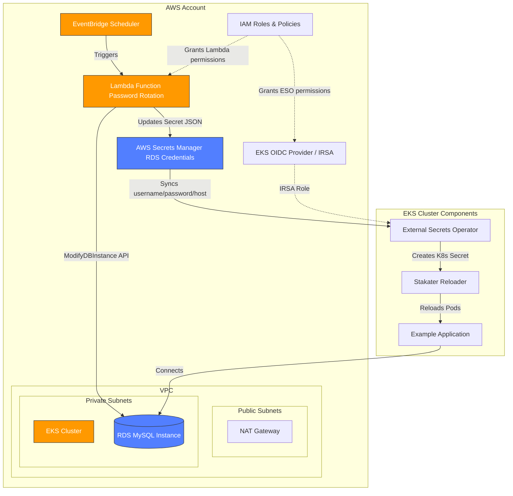

# Complete RDS Password Rotation for Kubernetes

This Terraform project creates everything from scratch:
- VPC with public/private subnets
- EKS cluster with node group
- RDS MySQL instance
- Lambda function for password rotation
- EventBridge scheduler
- External Secrets Operator
- Stakater Reloader
- Example application

## Architecture



## Prerequisites

- AWS account with credentials configured
- Terraform installed
- kubectl, helm, and AWS CLI (setup script included)

## Quick Setup

### 1. Install prerequisites

```bash
chmod +x scripts/setup-k8s-tools.sh
./scripts/setup-k8s-tools.sh